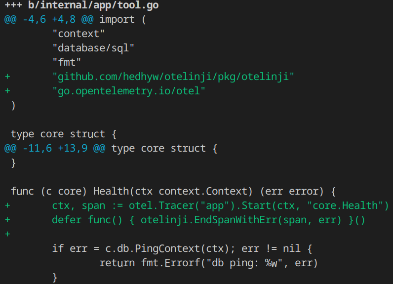

# otelinji


[](https://goreportcard.com/report/github.com/hedhyw/otelinji)
[](https://coveralls.io/github/hedhyw/otelinji?branch=main)

OpenTelemetry auto-instrumentation tool. It generates code with added OpenTelemetry blocks.



It injects a common open-telemetry block to all exported functions.

```diff
 func (c repo) Health(ctx context.Context) (err error) {
+       ctx, span := otel.Tracer("app").Start(ctx, "repo.Health")
+       defer func() { otelinji.EndSpanWithErr(span, err) }()
+
        if err = c.db.PingContext(ctx); err != nil {
                return fmt.Errorf("db ping: %w", err)
        }
```

For example, if we have a function:

```golang
func Example(ctx context.Context) {
   fmt.Println("Example")
}
```

Then the tool will add a common trace block:

```go
func Example(ctx context.Context) {
    ctx, span := otel.Tracer("package").Start(ctx, "Example")
    defer span.End()

    _ = ctx

    fmt.Println("Example")
}
```

Features:
- Custom templates are supported. Example: [template](./internal/pkg/assets/otel.tmpl).
- If the function contains a named `err` result parameter,
  then `err` will be recorded in the span.
- It supports different names of `ctx` parameter.
- This can also be used with OpenTracing, but will require a custom template.
- Using creativity, this can be used for any inserts at the beginning of the function.

## Installation

### MacOS/Linux HomeBrew

```sh
brew install hedhyw/main/otelinji
```

### Deb/Rpm

Latest DEB and RPM packages are available on [the releases page](https://github.com/hedhyw/otelinji/releases/latest).

### Go

```sh
go install github.com/hedhyw/otelinji/cmd/otelinji@latest
```

### Source

```sh
git clone git@github.com:hedhyw/otelinji.git
cd gherkingen
task build # Requires https://taskfile.dev/
cp ./bin/gherkingen /usr/local/bin
chmod +x /usr/local/bin
```

## Usage

### Basic usage

Inject the layer and rewrite the file (be careful, always commit all changes first).
- `otelinji -filename input_file.go > input_file.go`

  or

- `otelinji -w -filename input_file.go`

  or in docker

- ```sh
  docker run \
        --rm \
        --read-only \
        --network none \
        --rm \
        --volume $PWD:/host \
        hedhyw/otelinji:latest \
        -filename /host/internal/pkg/assets/assets_test.go
  ```

### Recursive run

Running for all Go files in the current directory.
```sh
# It will inject the layer to all exported functions.
# It will ignore vendor and .git folders, test and generated files.

find . -name "*.go" \
    | grep -v "vendor/\|.git/\|_test.go" \
    | xargs -n 1 -t otelinji -w -filename
```

The same in docker:
```sh
docker run \
      --rm \
      --read-only \
      --network none \
      --volume $PWD:/host \
      --entrypoint sh \
      hedhyw/otelinji:latest \
      -c " \
            find /host -name \"*.go\" \
            | grep -v \"vendor/\|.git/\|_test.go\" \
            | xargs -n 1 -t /app/otelinji -w -filename \
      "
```

### Help

```
otelinji --help

Usage of otelinji:
  -filename string
        golang file [required]
  -skip-generated DO NOT EDIT
        skip files with DO NOT EDIT comment (default true)
  -template string
        path to template file [optional] (default "@/otel")
  -w    write result to file [optional]
```

### License

[MIT](./LICENSE).
